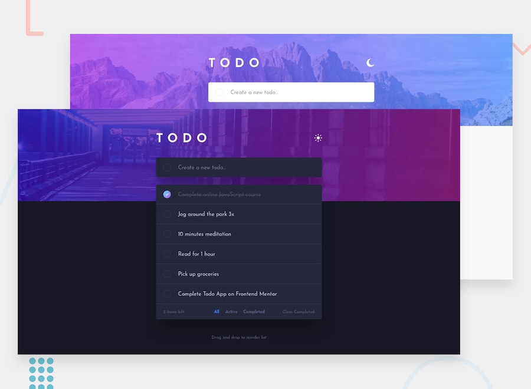

## Welcome! 👋
# 📝 Todo App - Frontend Mentor Challenge

---

Live Demo: https://todo-app-main-ashen-one.vercel.app/

---

## 📌 Overview

This is a Todo App built as a solution to the **Frontend Mentor challenge**.  
It helps users manage daily tasks with a clean and interactive UI.

---

## ✨ Features

- ➕ Add new todos
- ✔ Mark todos as complete / active
- ❌ Delete todos
- 🔍 Filter todos (All / Active / Completed)
- 🧹 Clear completed todos
- 🌙 Light / Dark mode toggle
- 💾 Data saved in Local Storage
- 📱 Fully responsive design

---

## 🛠️ Built With

- HTML5
- CSS3
- JavaScript (Vanilla JS)
- Local Storage API

---

## 🚀 Deployment

The project is deployed using **Vercel**:

👉 https://todo-app-main-ashen-one.vercel.app/

Any new push to the GitHub repository will automatically update the live site.

---

## 📁 Project Structure
